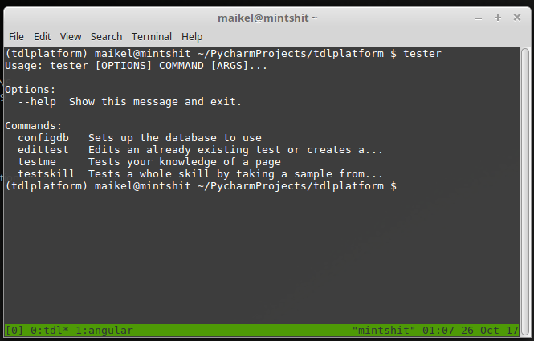
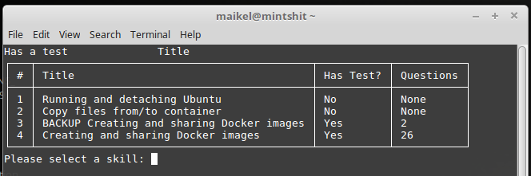
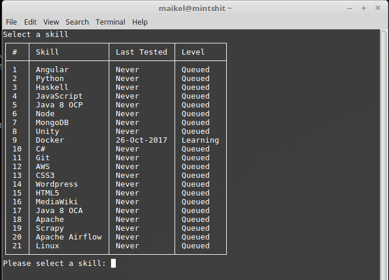

##Test-Driven Learning platform

This is a platform to test the knowledge gathered in www.maikel.uk or any other website using my learningCMS project. 

It works by connecting tot he same Mongo database than the site uses and creating tests by the user while studying any of the skills that they later would test themselves. 

Depending on the mark they get on the tests, the skill on the site is changed to "Tested Passed" (over 75%) or "Tested Learning" (below 75%)

###So far the features it currently has:
- Configure which DB to connect. 
- Select a skill, a page and create tests. 
- Test yourself in the content of a page. 
- Test yourself about a full skill. 
- Save scores of pages or skills. 
- When saving scores of skills, change the status of the skill on the site. 

###Coming up features:
- Reminders based on the [forgetting curve](https://en.wikipedia.org/wiki/Forgetting_curve)
- Knowledge going automatically back to learning if after the reminder, the user doesn't test himself in a window of time of 48 hours

As you might imagine this is focused in productivity and retrieval.The more you retrieve the knowledge about a programming language or skill, the faster you become using it. The faster you are, the more than you can focus on **creativity** and having fun!

###Some screenshots

Help

Page Selection

Skill Selection
